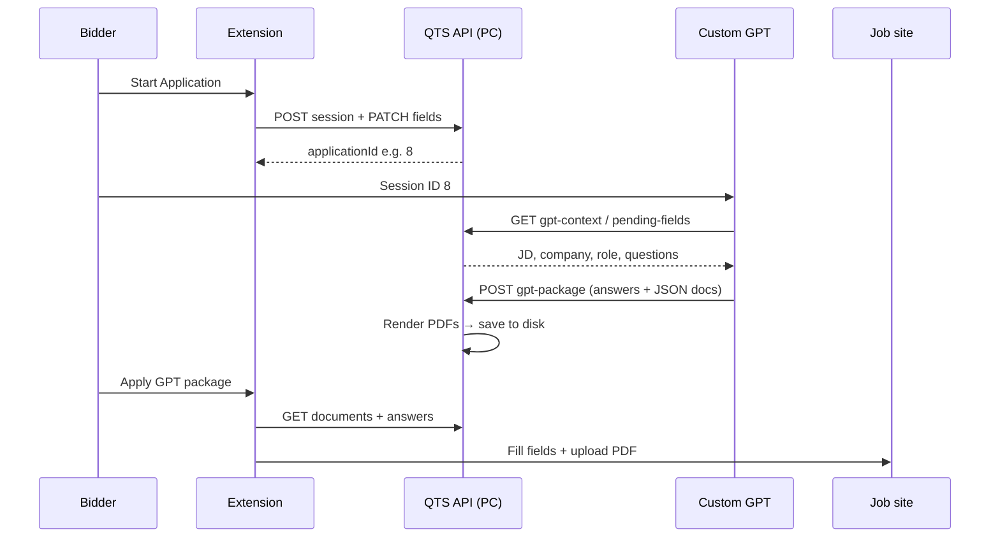

# QTS Job Tracking — Custom GPT Integration Guide

**File:** `QTS-JOB-TRACKING-CUSTOM-GPT-GUIDE.md`  
**For:** Building the GPT → server → extension application automation pipeline  
**Requires:** ChatGPT Plus/Team, running QTS API (`start-server.bat`), Chrome extension v1.7+

Related guides:
- `QTS-APPLICATION-WORKFLOW.md` — full application pipeline architecture and operating rules
- `QTS-JOB-TRACKING-EXTENSION-GUIDE.md` — extension capture & Start Application
- `QTS-JOB-TRACKING-PROJECT-SETUP-GUIDE.md` — server & Vercel setup

---

## Table of contents

1. [What you are building](#1-what-you-are-building)
2. [Architecture (3 layers)](#2-architecture-3-layers)
3. [What exists today vs what to build](#3-what-exists-today-vs-what-to-build)
4. [JSON schemas for PDFs](#4-json-schemas-for-pdfs)
5. [PC file paths for PDFs](#5-pc-file-paths-for-pdfs)
6. [Step 1 — Prepare the server](#6-step-1--prepare-the-server)
7. [Step 2 — Create a GPT API token](#7-step-2--create-a-gpt-api-token)
8. [Step 3 — Create Custom GPT](#8-step-3--create-custom-gpt)
9. [Step 4 — Import OpenAPI Actions](#9-step-4--import-openapi-actions)
10. [Step 5 — GPT instructions (copy/paste)](#10-step-5--gpt-instructions-copypaste)
11. [Step 6 — End-to-end workflow](#11-step-6--end-to-end-workflow)
12. [Step 7 — Test & verify](#12-step-7--test--verify)
13. [Application task API (implemented)](#13-application-task-api-implemented)
14. [Troubleshooting](#14-troubleshooting)

---

## 1. What you are building

**Goal:** After the extension scans a job application form:

1. **Custom GPT** receives job context (JD, company, role, candidate, pending questions).
2. GPT outputs structured **JSON** (resume + cover letter + field answers).
3. GPT sends JSON to **your server** via **Actions** (OpenAPI).
4. **Server** generates PDF files, saves them on your **PC disk**, stores paths on the application session.
5. **Extension** fills text answers and uploads PDFs to the form (`input[type=file]`).

```text
Extension (scan)  →  Server (session + fields)
                           ↑
Custom GPT (JSON)  ────────┘
                           ↓
                    PDF on PC disk
                           ↓
Extension (fill + upload)  →  Job site form
```

**Custom GPT does NOT** open the browser or upload files directly. It only talks to your API.

---

## 2. Architecture (3 layers)

| Layer | Responsibility |
|-------|----------------|
| **Chrome extension** | Scan form, create session, show Session ID, apply answers + upload PDFs from server paths |
| **Node API (PC)** | Sessions, field storage, PDF render from JSON, save files locally, serve paths/blobs to extension |
| **Custom GPT** | Read context via Actions, write answers + resume/cover JSON, POST package to server |



---

## 3. What exists today vs what to build

### Already implemented

| Item | Status |
|------|--------|
| `POST /api/application-sessions` | Done — returns random `taskId` (e.g. `task_a1b2c3d4-...`) |
| `PATCH /api/application-sessions/{id}/fields` | Done |
| `GET /api/application-sessions/{id}/pending-fields` | Done |
| `POST /api/application-sessions/{id}/answers` | Done |
| `GET /api/application-sessions/{id}/result` | Done |
| `GET /api/application-tasks/{taskId}/context` | Done — job + candidate + `pendingAiFields` + `fileFields` |
| `POST /api/application-tasks/{taskId}/package` | Done — answers + resume/cover JSON → PDFs on disk |
| `GET /api/application-tasks/{taskId}/status` | Done |
| `GET /api/application-sessions/{id}/documents/{type}` | Done — extension downloads PDF bytes |
| Extension scan / classify / fill profile | Done |
| Extension GPT poll + apply (background) | Done — uploads resume PDF to file input |
| DEV capture JSON panel | Done |

Legacy numeric aliases (`task_8` → session `8`) still work for testing but new sessions use UUID task IDs.

### Optional / future

| Item | Purpose |
|------|---------|
| Multi-step page-by-page loop | Scan → fill → Next → rescan (see `QTS-APPLICATION-WORKFLOW.md` §14) |
| Stronger task ownership checks | Beyond unguessable task IDs |

Schema files (ready to use):

- `docs/schemas/resume-document.schema.json`
- `docs/schemas/cover-letter-document.schema.json`
- `docs/schemas/gpt-application-package.schema.json`
- `docs/openapi/custom-gpt-application-actions.yaml`

---

## 4. JSON schemas for PDFs

GPT must return **structured JSON**, not raw PDF bytes. The server turns JSON into PDF.

### Resume JSON (minimal example)

```json
{
  "candidate": {
    "fullName": "Andrei Victor",
    "email": "andreivictor4422@gmail.com",
    "phone": "+48 738 060 700",
    "linkedinUrl": "https://linkedin.com/in/example",
    "location": "Warsaw, Poland",
    "headline": "Senior Data / ML Engineer"
  },
  "targetRole": "Senior Cloud Platform Engineer",
  "targetCompany": "Team Connect",
  "summary": "Platform engineer with 8+ years building cloud infrastructure and CI/CD at scale.",
  "sections": [
    {
      "title": "Experience",
      "items": [
        {
          "heading": "Cloud Engineer — Acme Corp",
          "subheading": "Remote",
          "dateRange": "2021 – Present",
          "bullets": [
            "Led Kubernetes migration reducing deploy time by 40%",
            "Built Terraform modules for multi-region AWS"
          ]
        }
      ]
    },
    {
      "title": "Skills",
      "items": [
        { "heading": "AWS, Kubernetes, Terraform, Python, DevOps" }
      ]
    }
  ]
}
```

### Cover letter JSON (minimal example)

```json
{
  "candidate": {
    "fullName": "Andrei Victor",
    "email": "andreivictor4422@gmail.com",
    "phone": "+48 738 060 700"
  },
  "targetRole": "Senior Cloud Platform Engineer",
  "targetCompany": "Team Connect",
  "date": "2026-06-25",
  "salutation": "Dear Hiring Manager,",
  "bodyParagraphs": [
    "I am applying for the Senior Cloud Platform Engineer role at Team Connect. My background in cloud infrastructure aligns with your DevOps-focused team.",
    "In my recent role I designed CI/CD pipelines and managed Kubernetes clusters serving production workloads. I am comfortable with the stack mentioned in your posting.",
    "I would welcome the opportunity to discuss how I can contribute to Team Connect."
  ],
  "closing": "Sincerely,",
  "signatureName": "Andrei Victor"
}
```

### Full GPT package (what Actions POST sends)

```json
{
  "answers": [
    {
      "stableFieldId": "fp:abc123",
      "answer": "I am excited about this role because..."
    }
  ],
  "resume": { },
  "coverLetter": { },
  "remainingFields": [
    { "stableFieldId": "name:create_account_accepted:checkbox", "answer": "true" }
  ],
  "notes": "Tailored resume emphasis: Kubernetes, AWS, DevOps"
}
```

Full schema: `docs/schemas/gpt-application-package.schema.json`

---

## 5. PC file paths for PDFs

Recommended layout on the machine running `start-server.bat`:

```text
job-capture-system/
  server/
    data/
      application-documents/
        {applicationId}/
          resume.pdf
          cover-letter.pdf
          resume.json          ← optional: store source JSON
          cover-letter.json
          manifest.json        ← paths + timestamps
```

Example after session `8`:

```text
server/data/application-documents/8/resume.pdf
server/data/application-documents/8/cover-letter.pdf
```

The API stores these paths on `application_sessions.metadata`:

```json
{
  "documents": {
    "resumePath": "C:/.../server/data/application-documents/8/resume.pdf",
    "coverLetterPath": "C:/.../server/data/application-documents/8/cover-letter.pdf"
  }
}
```

Extension reads paths from API → fetches file bytes → injects into `input[type=file]`.

---

## 6. Step 1 — Prepare the server

1. **Restart API** so application-session routes are loaded:
   ```bat
   stop-server.bat
   start-server.bat
   ```

2. **Verify health:**
   ```text
   https://qts-job-tracking.vercel.app/api/health
   ```

3. **Verify sessions API** (replace `TOKEN` and test after login):
   ```http
   GET https://qts-job-tracking.vercel.app/api/application-sessions/1/result
   Authorization: Bearer TOKEN
   ```

4. Create documents folder (once):
   ```bat
   mkdir server\data\application-documents
   ```

5. **Implement PDF renderer** (already included in server) — ensure `server/data/application-documents` exists.

---

## 7. Step 2 — Create a GPT API token

Custom GPT Actions need a **Bearer token** your API accepts. Use a **dedicated static key** for GPT Actions (recommended), separate from the bidder JWT used by the extension.

### Option A — `GPT_ACTION_API_KEY` (recommended)

1. In `server/.env`, set a long random secret:
   ```env
   GPT_ACTION_API_KEY=qts_gpt_action_replace_with_long_random_secret
   ```
2. Restart the server (`stop-server.bat` → `start-server.bat`).
3. In ChatGPT Action authentication, paste the same value as **API Key** / Bearer.

The server accepts either this key (for Custom GPT Actions) or a normal bidder/admin JWT (for the extension).

### Option B — Bidder JWT (testing only)

1. In QTS admin/manager UI, create a bidder user e.g. `gpt_service` (or use existing bidder).
2. Log in via API:
   ```http
   POST https://qts-job-tracking.vercel.app/api/auth/login
   Content-Type: application/json

   { "username": "gpt_service", "password": "YOUR_PASSWORD", "extension": true }
   ```
3. Copy `token` from response.
4. Store in ChatGPT Action authentication as **API Key** / Bearer.

### Option C — Personal bidder token

Use your own bidder login token. Simpler for testing; rotate if leaked.

**Security:** Never commit tokens to git. Regenerate JWT if exposed.

---

## 8. Step 3 — Create Custom GPT

1. Open [https://chatgpt.com](https://chatgpt.com) (paid plan).
2. Left sidebar → **Explore GPTs** → **Create**.
3. **Name:** `QTS Job Application Assistant`
4. **Description:** `Generates tailored resume/cover letter JSON and application answers for QTS Job Tracking sessions.`
5. **Instructions:** paste from [Section 10](#10-step-5--gpt-instructions-copypaste).
6. **Conversation starters** (optional fallback only):
   - You may add `PROCESS_TASK` as a starter for manual testing.
   - The extension opens a **fresh** Custom GPT conversation and pastes `PROCESS_TASK: <taskId>` into the composer. It does **not** auto-click conversation starters or **Allow** on Action dialogs — the bidder must approve Actions manually.
7. **Knowledge:** upload optional:
   - `docs/schemas/resume-document.schema.json`
   - `docs/schemas/cover-letter-document.schema.json`
   - `docs/schemas/gpt-application-package.schema.json`
8. **Capabilities:** turn **off** Code Interpreter and DALL·E unless you need them (reduces confusion).
9. **Actions:** configure in next step.

---

## 9. Step 4 — Import OpenAPI Actions

1. In GPT editor → **Actions** → **Create new action**.
2. **Import from URL** or paste schema from:
   ```
   docs/openapi/custom-gpt-application-actions.yaml
   ```
3. **Authentication:**
   - Type: **API Key**
   - Auth Type: **Bearer**
   - API Key: paste `GPT_ACTION_API_KEY` from `server/.env` (or a bidder JWT for testing)
4. **Privacy policy URL:** your Vercel app URL (required by OpenAI).
5. Save action.

### Enabled operations

| Operation | Purpose |
|-----------|---------|
| `getTaskContext` | Job + candidate + pending AI fields + file upload slots |
| `submitTaskPackage` | Answers + resume/cover JSON → server renders PDFs |
| `getTaskStatus` | Confirm `gptTaskStatus: ready` before extension applies |

Legacy session-scoped endpoints (`getPendingFields`, `getApplicationResult`) remain available on `/api/application-sessions/{id}/...` for debugging.

---

## 10. Step 5 — GPT instructions (copy/paste)

Copy into Custom GPT **Instructions**:

```text
You are the QTS Job Application Assistant for the QTS-Job-Tracking system.

TRIGGER — start immediately, no confirmation
Run the workflow below when ANY of these user messages arrive:
  A) Starts with PROCESS_TASK:   e.g. PROCESS_TASK: task_a1b2c3d4-e5f6-7890-abcd-ef1234567890
  B) Exactly task_<id>           e.g. task_a1b2c3d4-e5f6-7890-abcd-ef1234567890
  C) Legacy numeric only         e.g. 8  → treat as task_8 (testing only)

Extract taskId from the message (format: task_<uuid> or legacy task_<number>).

WORKFLOW
1. Immediately call getTaskContext with that taskId. Do not ask for confirmation.
2. Read from the API response: job title, company, job description, candidate (name, email, phone), pendingAiFields, fileFields, documentRequirements.
3. Generate the application package:
   a) answers[] — one object per pending AI field: { "stableFieldId": "...", "answer": "..." }
   b) resume — JSON matching resume-document.schema.json (required when fileFields is non-empty or resumeRequired is true)
   c) coverLetter — JSON matching cover-letter-document.schema.json (always include; tailored to company and role)
   d) remainingFields — only non-consent optional fields; NEVER include terms, GDPR, marketing, or cover message (bidder reviews those manually)
4. Call submitTaskPackage:
   - taskId goes in the URL path only (e.g. /api/application-tasks/task_<uuid>/package)
   - JSON body = answers + resume + coverLetter + remainingFields + optional notes
   - Do NOT put taskId or applicationId in the JSON body
5. Call getTaskStatus(taskId) and confirm gptTaskStatus is "ready" or readyToApply is true.
6. Reply in one short line: "Task <taskId> saved. Extension will apply answers."

When ChatGPT shows an Action confirmation dialog, wait for the bidder to click Allow — do not assume auto-approval.

RULES
- Never invent candidate email, phone, name, or employers — use only API data.
- Resume and cover letter must match the job description, company, and role.
- For checkbox fields: answer only "true" or "false".
- Do NOT set terms_accepted, gdpr_consent, marketing_opt_in, or cover_message in remainingFields — the bidder fills those on the job site.
- For essay/text questions: 80–180 words unless the label clearly needs shorter.
- Do not claim you uploaded files to the job site — the Chrome extension uploads PDFs after your package is saved.
- If an API call fails, report the error clearly (401 = auth problem, 404 = task/session not found).
- If getTaskContext shows fileFields but you omit resume, submitTaskPackage will fail — always include resume JSON when a file upload field exists.
```

---

## 11. Step 6 — End-to-end workflow

### Phase A — Extension

1. Open job **application form** (job tab stays active).
2. Extension → **Start Application** → preview → **Confirm & fill form**.
3. Extension fills **name + email only**; CV and consent fields stay for GPT / manual review.
4. Extension creates server task with random `taskId`, opens **pinned Custom GPT tab** (fresh conversation), pastes `PROCESS_TASK: <taskId>`.
5. Extension polls server in the background until `gptTaskStatus: ready`, then uploads resume PDF and fills non-consent answers.

### Phase B — Custom GPT (pinned tab)

1. Receives `PROCESS_TASK: task_<uuid>` from extension composer (or bidder pastes manually if handoff fails).
2. Bidder clicks **Allow** when ChatGPT prompts for Action approval.
3. GPT calls `getTaskContext` → generates answers + resume/cover JSON.
4. GPT calls `submitTaskPackage` → server marks task ready and writes PDFs to disk.

### Phase C — Review (bidder)

1. Verify resume uploaded and answers filled on the job form.
2. Manually check terms, GDPR, marketing opt-in, and any declarations.
3. Click the job site **Apply** / **Submit** button yourself — the extension never auto-submits.

---

## 12. Step 7 — Test & verify

### Checklist after GPT run

| Check | How |
|-------|-----|
| Answers saved | `GET .../result` → `aiPending: 0` |
| Resume PDF exists | File at `server/data/application-documents/{id}/resume.pdf` |
| Cover PDF exists | `cover-letter.pdf` in same folder |
| Paths on session | `metadata.documents` in GET session |
| Form filled | Extension apply step (when built) |

### Manual API test (PowerShell)

```powershell
$token = "YOUR_JWT"
$headers = @{ Authorization = "Bearer $token" }
Invoke-RestMethod "https://qts-job-tracking.vercel.app/api/application-sessions/8/result" -Headers $headers
```

### Test GPT package (after endpoint exists)

```http
POST https://qts-job-tracking.vercel.app/api/application-sessions/8/gpt-package
Authorization: Bearer TOKEN
Content-Type: application/json

{ "answers": [...], "resume": {...}, "coverLetter": {...} }
```
(URL path: `POST .../application-sessions/8/gpt-package` — session ID is not repeated in the body.)
```

---

## 13. Application task API (implemented)

Task-scoped routes under `/api/application-tasks/{taskId}/` (see `docs/openapi/custom-gpt-application-actions.yaml`):

### `GET /api/application-tasks/:taskId/context`

Returns everything for GPT in one response: `jobContext`, `candidate`, `pendingAiFields`, `fileFields`, `documentGeneration`, `packageSchema`.

### `POST /api/application-tasks/:taskId/package`

1. Validate body against `gpt-application-package.schema.json`
2. Merge `answers` + `remainingFields` into `application_session_fields`
3. Render `resume` JSON → `resume.pdf`
4. Render `coverLetter` JSON → `cover-letter.pdf`
5. Save under `server/data/application-documents/{applicationId}/`
6. Update session metadata with document paths
7. Set `gptTaskStatus: ready`

### `GET /api/application-tasks/:taskId/status`

Returns `gptTaskStatus`, `readyToApply`, and field counts for extension polling.

### `GET /api/application-sessions/:id/documents/:type`

- `type` = `resume` | `cover-letter`
- Returns `application/pdf` bytes for extension upload

---

## 14. Troubleshooting

| Problem | Fix |
|---------|-----|
| GPT Action 404 | Restart server; confirm Vercel proxy + `start-server.bat` |
| GPT Action 401 | Check `GPT_ACTION_API_KEY` in `.env` matches Action auth |
| GPT can't reach API | Ensure tunnel running; test `/api/health` |
| GPT stuck on Allow | Expected — bidder must click Allow manually (extension does not auto-click) |
| Composer handoff failed | Open pinned GPT tab; paste `PROCESS_TASK: <taskId>` from extension popup |
| PDF not on disk | Check `server/data/application-documents/{id}/` |
| Resume not uploaded | Reload extension v1.7.7+; confirm `gptTaskStatus: ready` |
| Marketing/terms auto-filled | Update extension — consent fields are manual-only |

---

## Quick reference

| Artifact | Path |
|----------|------|
| Resume JSON schema | `docs/schemas/resume-document.schema.json` |
| Cover letter JSON schema | `docs/schemas/cover-letter-document.schema.json` |
| GPT package schema | `docs/schemas/gpt-application-package.schema.json` |
| OpenAPI for Actions | `docs/openapi/custom-gpt-application-actions.yaml` |
| PDF output folder | `server/data/application-documents/{applicationId}/` |
| Extension entry | Start Application → Confirm & fill → GPT poll/apply in background |
| Full workflow doc | `QTS-APPLICATION-WORKFLOW.md` |

---

*For architecture details and operating boundaries, see `QTS-APPLICATION-WORKFLOW.md`.*
